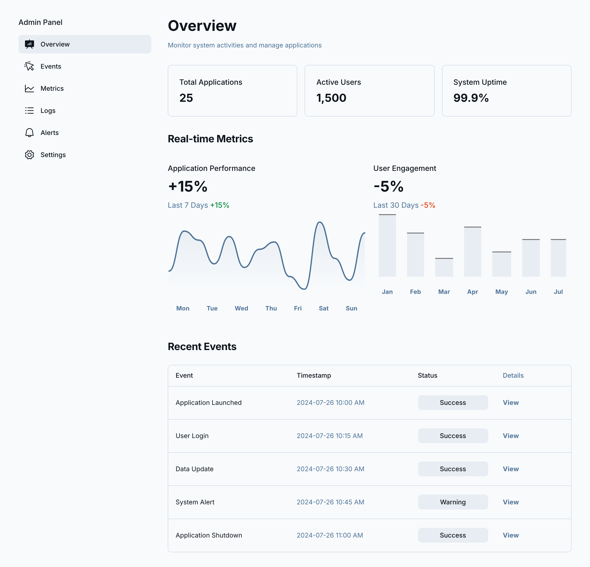

# 🛠️ Admin Dashboard (Next.js + Supabase)

A modern, full-featured admin dashboard built with Next.js 15, TypeScript, and Supabase authentication. This dashboard provides comprehensive system monitoring, user management, and administrative tools with a clean, professional interface.

<!-- Dashboard Preview -->
<p align="center">
  
</p>

## ✨ Features

### 🔐 Authentication & Security
- **Email/Password Authentication** via Supabase
- **Protected Routes** with Next.js middleware
- **Session Management** with automatic redirects
- **Secure Logout** functionality

### 📊 Dashboard Pages
- **Overview** - System metrics and recent activities
- **Events** - Event management with filtering and status tracking
- **Metrics** - Performance monitoring and analytics
- **Logs** - System logs with search and filtering
- **Alerts** - Alert management and notification settings
- **Settings** - System configuration and user management

### 🎨 User Interface
- **Modern Design** with clean, professional styling
- **Responsive Layout** that works on all devices
- **Interactive Components** with hover effects and animations
- **Consistent Styling** throughout the application

## 🛠️ Tech Stack

- **Framework**: Next.js 15 (App Router)
- **Language**: TypeScript
- **Authentication**: Supabase Auth
- **Styling**: Tailwind CSS v4
- **Database**: Supabase (PostgreSQL)
- **Deployment**: Ready for Vercel

## 🚀 Getting Started

### Prerequisites
- Node.js 18+ 
- npm, yarn, pnpm, or bun
- Supabase account and project

### 1. Clone the Repository
```bash
git clone <your-repo-url>
cd my-app
```

### 2. Install Dependencies
```bash
npm install
# or
yarn install
# or
pnpm install
```

### 3. Set Up Supabase
1. Create a new project at [supabase.com](https://supabase.com)
2. Go to Settings → API to get your project URL and anon key
3. Create a `.env.local` file in the root directory:

```env
NEXT_PUBLIC_SUPABASE_URL=your-supabase-project-url
NEXT_PUBLIC_SUPABASE_ANON_KEY=your-supabase-anon-key
```

### 4. Configure Authentication (Optional)
If you want users to sign up without email confirmation:
1. Go to your Supabase dashboard
2. Navigate to Authentication → Settings
3. Disable "Email Confirmations"

### 5. Run the Development Server
```bash
npm run dev
# or
yarn dev
# or
pnpm dev
```

Open [http://localhost:3000](http://localhost:3000) with your browser to see the result.

## 📁 Project Structure

```
my-app/
├── app/                    # Next.js app directory
│   ├── components/         # Reusable components
│   │   └── Sidebar.tsx    # Navigation sidebar
│   ├── login/             # Login page
│   ├── signup/            # Signup page
│   ├── events/            # Events management
│   ├── metrics/           # Performance metrics
│   ├── logs/              # System logs
│   ├── alerts/            # Alert management
│   ├── settings/          # System settings
│   ├── layout.tsx         # Root layout
│   ├── page.tsx           # Dashboard overview
│   └── globals.css        # Global styles
├── lib/                   # Utility functions
│   └── supabaseClient.ts  # Supabase client configuration
├── public/                # Static assets
├── middleware.ts          # Route protection
└── package.json           # Dependencies and scripts
```

## 🔐 Authentication Flow

1. **Signup**: Users create accounts with email/password
2. **Login**: Users authenticate and are redirected to dashboard
3. **Route Protection**: Middleware ensures only authenticated users access protected pages
4. **Logout**: Users can sign out and are redirected to login

## 🎯 Available Scripts

- `npm run dev` - Start development server with Turbopack
- `npm run build` - Build for production
- `npm run start` - Start production server
- `npm run lint` - Run ESLint

## 🚀 Deployment

### Deploy on Vercel (Recommended)
1. Push your code to GitHub
2. Import your repository to [Vercel](https://vercel.com)
3. Add your environment variables in Vercel dashboard
4. Deploy!

### Environment Variables for Production
Make sure to set these in your deployment platform:
- `NEXT_PUBLIC_SUPABASE_URL`
- `NEXT_PUBLIC_SUPABASE_ANON_KEY`

## 🔧 Customization

### Adding New Pages
1. Create a new directory in `app/` (e.g., `app/users/`)
2. Add a `page.tsx` file with your component
3. Update the navigation in `app/components/Sidebar.tsx`

### Styling
- Global styles are in `app/globals.css`
- Component-specific styles use inline styles or Tailwind classes
- The design system uses a consistent color palette and spacing

### Authentication
- Supabase client is configured in `lib/supabaseClient.ts`
- Middleware handles route protection in `middleware.ts`
- Auth state is managed client-side with Supabase hooks

## 🤝 Contributing

1. Fork the repository
2. Create a feature branch (`git checkout -b feature/amazing-feature`)
3. Commit your changes (`git commit -m 'Add amazing feature'`)
4. Push to the branch (`git push origin feature/amazing-feature`)
5. Open a Pull Request

## 📝 License

This project is licensed under the MIT License - see the [LICENSE](LICENSE) file for details.

## 🙏 Acknowledgments

- Built with [Next.js](https://nextjs.org/)
- Authentication powered by [Supabase](https://supabase.com/)
- Styled with [Tailwind CSS](https://tailwindcss.com/)
- Icons and design inspiration from modern admin dashboards
